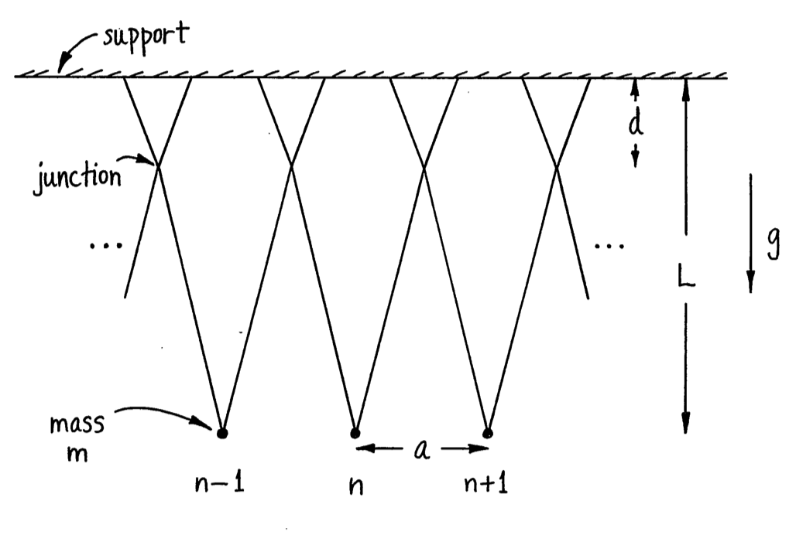
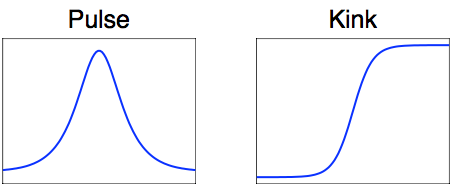
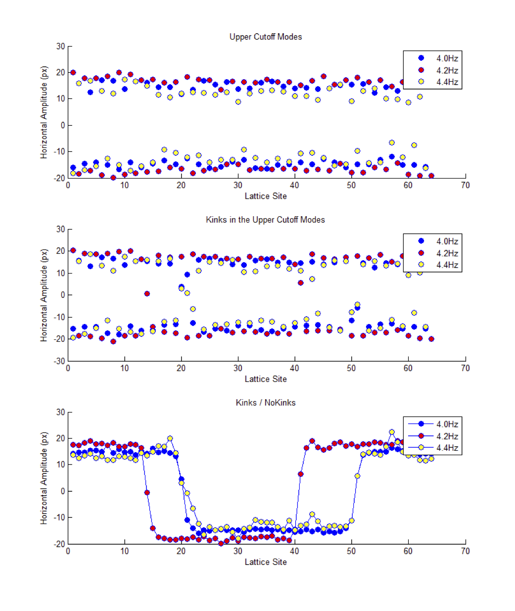
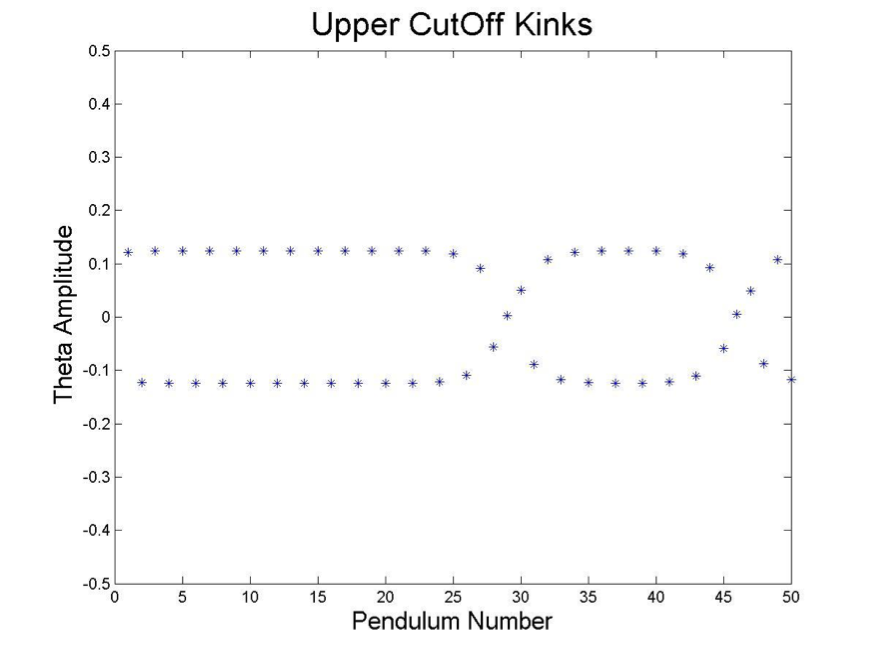
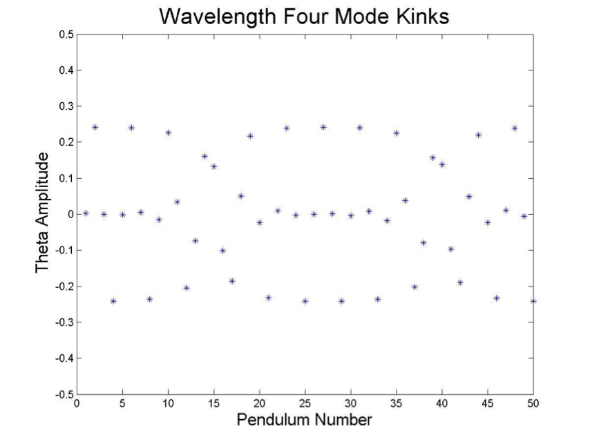

The goal of this project was to observe and understand oscillating patterns in a large array of pendulums. This system provides a simple experimental model in which _solitons,_ or something much like them, can be observed. This system was first studied in the Ph.D. dissertation of Denardo[^1] and in several followup articles, from whom some of our images are borrowed. Prof. Goodman learned about this experimental system in a talk by Victor Sánchez-Morcillo at the [LENCOS 2012][lencos] conference. It has since been published in _Modeling in Science Education and Learning_[^2].

[^1]: B. C. Denardo, *Observations of Nonpropagating Oscillatory Solitons*. Ph.D. Thesis, UCLA, Aug. 1990.

[lencos]: http://congreso.us.es/lencos/

[^2]:	V. Sánchez-Morcillo, N. Jiménez, N. González, S. Dos Santos, A. Bouakaz, and J. Chaline, “Modeling Acoustically Driven Microbubbles by Macroscopic Discrete-Mechanical Analogues,” Modelling in Science Education and Learning, vol. 6, pp. 75–87, 2013.

Professor Goodman's group learned about nonlinear waves, perturbation methods in mechanics, and dynamical systems.



The pendulum is a fundamental object of study in mechanics. Students in their first semester of physics learn that a pendulum of length $l$ subject to gravitational acceleration $g$ moves according to the differential equation

$ \frac{d^2}{dt^2} \theta = -\frac{g}{l} \sin{\theta} $

where $\theta$ is the angular displacement from its stable rest position. They then learn to analyze this system when $\theta$ is small by using $\sin\theta \approx \theta$. This approximation linearizes the equation, and has the solution $\theta(t) = A \cos{\omega (t-t_0)} $, where $\omega^2 = \tfrac{g}{l}$.

Most students stop there, but there's way more to the pendulum than that! In the 1950's, the Russian physicist Piotr Kapitza demonstrated that rapid vertical oscillation of the pendulum's support stabilizes the pendulum in the *upright* direction, a fact which we learned to analyze with the method of averaging, and which we demonstrated by connecting a pendulum to an electric jigsaw, as shown in this video by Mark Levi from Penn State University



Nonlinear effects---those ignored by linearizing the linearized assumption made above---are responsible for much of the interesting behavior seen in pendulums.

# Experimental Setup #

The pendulums consist simply of beads set on V-shaped strings arranged around a circular metal frame. Each "V" overlaps with, and is attached to, its two nearest neighbors; see schematic below. The entire frame is mounted to a speaker, which oscillates vertically at a frequency specified by an alternating current pattern generator.

# Mathematical Analysis #

## The damped and parametically-driven pendulum ##

A single pendulum is driven by vertically oscillating its point of support at about twice the pendulum's natural frequency. After scaling $\theta=O(\epsilon)$ and truncating the Taylor series for the sine function at cubic degree, it satisfies a nonlinear version of the Mathieu equation:

$$\ddot \theta + \epsilon \mu \dot \theta + \left( (1 + \epsilon \delta + \epsilon\cos{(2t)} \right) \theta -\frac{ \epsilon}{6} \theta^3 = 0. $$

The frequency of the driver is chosen to excite the pendulum's natural frequency of oscillation, with a slight detuning.
The students analyzed this system using the method of multiple scales.
If the pendulum's natural frequency is sufficiently detuned from that of the driver, specifically if $\delta>1$, then the system is *bistable*, with both the solution $\theta=0$ and an oscillating solution being possible and stable. This condition is necessary for the existence of "localized pulse" solutions to a large chain of pendulums.

## Array of pendulums ##

Now we consider an array of pendulums, each with angular displacement $\theta_n(t)$. Ignoring damping and driving, these satisfy:
$$\ddot \theta_n  +  \theta_n -\frac{ \epsilon}{6} \theta_n^3 - \nu( \theta_{n+1} - 2\theta_n + \theta_{n-1})= 0.$$

## Schrödinger equation ##
Following Miller [^3], we derive an *envelope* equation which looks for slow variations in the terms

$\theta_n = A(X,T_1,T_2) e^{i (\delta n -\omega t)} + c.c. $

where $X,T_1,\text{ and } T_2$ are *slow variables* and $\delta$ is the discrete wave number. We find in the end that this system has dispersion relation $\omega^2 = \omega_0^2 + 2 \nu ( 1 - \cos{\delta} )$ and that $A$ satisfies the *Nonlinear Schrödinger equation* (NLS).

$$i \frac{d}{dT_2}A_{\tau} + \frac{\omega''}{2} A_{\xi \xi} + \frac{\omega_0^2}{4 \omega} |A|^2 A = 0 . $$

For $\delta$ near zero, the pendulums are all approximately in phase, and $\omega''>0$, and $A$ satisfies the *defocusing* NLS equation. This system is known to have pulse-like solutions, in which $A$ is only nonzero in a small area of space. When $\delta\approx\pi$, so that adjacent pendulums are approximately 180^o^ out of phase it satisfies the *focusing* NLS equation, which has kink-like solutions.

In our experiments, we try to excite various shapes by oscillating the system at twice their oscillatory frequency. We succeeded in finding the kink solutions, but not the pulse solutions.

[^3]: P. D. Miller. *Applied Asymptotic Analysis*.  American Mathematical Society, 2006.

# Experiments #

Here is a movie of one experiment. This is at the so-called cutoff frequency, with $\delta = \pi$, and consecutive pendulums 180^o^ out of phase. It is kind of mesmerizing!



And here is the movie after video-processing:



We also show similar movies in which two kinks are present, one near the top, and one on the bottom right. Note that the kinks have a definite width.

See this youtube video:



And this one:



We  processed data from these videos using the MATLAB Image Processing Toolbox to find the width and see how it compared with theoretical predictions in Denardo et al. [^4]

[^4]: B. Denardo, B. Galvin, A. Greenfield, A. Larraza, S. Putterman, and W. Wright, *Observations of localized structures in nonlinear lattices: Domain walls and kinks,* Phys. Rev. Lett.  68,  pp. 1730–1733,  1992.

Finally, we performed numerical simulations of the system. We computed kinks at the upper cutoff $\delta=\pi.$

We also foundnd kinks with a wavelength-4 carrier.
