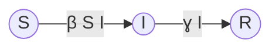

__NJIT Math 222__  

*This supplement introduces the basic SIR system used to model epidemics. There are a few questions at the end, to turn in via Canvas.*

There is a saying in science: "All models are wrong, but some are useful".[^allwrong] This is the story of one of those models.

[^allwrong]: https://en.wikipedia.org/wiki/All_models_are_wrong

We have all had our lives effected by the COVID-19 epidemic. In order to help the world recover from this problem, scientists with many different specialties have been attacking this problem from many angles. Never in the history of mankind has so much research on one topic been produced so quickly. 

This research spans a variety of disciplines. Virologists are trying to understand precisely how the virus attacks the body in order to design drugs that can fight it. Social psychologists are studying how to craft messages that will convince people to behave in ways that reduce transmission. (Wear your masks, people!) Experimental and theoretical fluid dynamicists are studying the propagation of virus-laden aerosols through the air, and how masks and ventilation protect against this.

You may have read in the news about models that governments are using to predict the spread of the disease and guide their strategies. Many of these models are based on _mathematical epidemiology_. The most basic such models go back to Kermack and McKendrick in 1927.[^1] By learning a little bit about such models, you can gain some understanding of some of the words that you might have heard on the news, and of how some of the mitigation strategies might work. In this assignment we discuss the simplest possible such model. Many of the models used by governments, while containing significantly more nuance and detail, are based on the same basic idea.

In this model, the population is divided into three subpopulations:
* The susceptible population $S(t)$,
* The infected population $I(t)$,
* The recovered population $R(t)$. We assume that the recovered have immunity for all time. Epidemiological modelers include the dead in this category, since infection can end in recovery or death, and by assumption neither can later become susceptible or infected.

There are two main assumptions about how individuals move between the groups

* $(A_1)$ Individuals move from the susceptible group to the infected group at a rate $\beta S I$ 

* $(A_2)$ Individuals move from the infected group to the recovered group at a rate $\gamma I$. 

  These assumptions are often represented using a diagram that looks like this:

The rate at which the susceptible population becomes infected is assumed to be jointly proportional to the  to both $S$ and $I$ and hence to their product. This comes from the following reasoning: suppose that the population is *well mixed*. This means that during any time interval, any two individuals come into contact with each other with equal likelihood. That means that, the probability that individuals from two groups come into contact with each other must be proportional to the *product of the sizes of the two groups*. The parameter $\beta$ is itself a product, $\beta= c p$, where the contact rate $c$ has dimension $[c]=\frac{\rm{contacts}}{\rm{population}\cdot \rm{time}}$ and $p$ is the probability of transmission per contact, which has dimensions $[p]=\frac{1}{\text{contacts}}$.

Putting this together gives a system of differential equations, called an _SIR model:_
$$
\begin{aligned}
\frac{\mathrm{d}}{\mathrm{d}t} S & = -\beta S I \\\\
\frac{\mathrm{d}}{\mathrm{d}t} I & = \beta S I - \gamma I\\\\
\frac{\mathrm{d}}{\mathrm{d}t} R & = \gamma I
\end{aligned}
$$

Several assumptions go into this model:
* The progress of the disease is sufficiently rapid that we can ignore changes in the subpopulations due to births and deaths from other causes. 
* Closed population, i.e., there is no immigration or emigration, nor the possibility of an infected person bringing the disease back from their travels.
* The _parameters_ $\beta$ and $\gamma$​ are constant in time, so that we do not model seasonal dependence, nor the evolution of the disease itself.
* The population is _well-mixed_, i.e. there is no dependence on physical location or subgroup identity, so that every individual encounters every other individual with equal probability.

#### Some observations

* $\frac{\mathrm{d}}{\mathrm{d}t} (S+I+R)=0$, so that if $S(0)+I(0)+R(0)=N$ then $S(t)+I(t)+R(t)=N$ for all $t$​.
* (Related) The evolution equations for $S(t)$ and $I(t)$ do not depend on $R(t)$. Therefore we can treat the system as a system of *two equations* for $S$ and $I$ and simply find the size of the recovered population using $R=N-S-I$​ .

#### Simulation results

Here we show the results of two simulations. In both situations, we initialize the system by introducing a small number of infected individuals $I_0$​​. In the first case, the number of infected individuals quickly decreases to zero and an epidemic is avoided. In the end about 10\% of the population has had the disease and 90% remain susceptible.



In the second case, the number of infected individuals *increases*, which we refer to as an epidemic. In the end about 95\% of the population has had the disease and 5% remain susceptible. At the epidemic's peak, 40\% of the population was infected.



In your assignment, you will explore how we can relate these two types of solution to the problem's parameters and initial conditions.

#### Questions

1. Where would the imposition or a stay-at-home order effect this model? In particular, how would the _parameters change_?
2. Where would widespread adoption of mask wearing effect this model, i.e. how would it effect the parameters?
3. Come up with a feature that you think is missing from the model but straightforward to add to the model, and propose a modification to the model that you think would incorporate this feature. In particular, identify any new variables or terms needed for you modified model. Here are a few ideas:

* Births of new babies and deaths due to other causes.
* Different populations that are more or less strict about following best practices to avoid spread.
* Possible re-infection, i.e., we no longer assume that immunity lasts a lifetime.
* Seasonality: in the winter, when people spend more time inside, and kids are in school, then the rate of transmission is increased, while in the summer, the opposite.
* The epidemics spurs news coverage. News consumption changes people's behaviors. These create a feedback loop.

4. Read [this article](https://www.statnews.com/2020/12/14/portrait-of-the-coronavirus-at-1/). It contains a lot of details about how Covid-19 spreads. Some of these would be quite difficult to add to a model. Identify one or more and state why you think they'd be hard to model.

---
For more information, see this nice article[^2]. [+plus Magazine](https://plus.maths.org/content/tags/covid-19) has a large collection of undergraduate-level articles on mathematics useful in understanding various aspects the COVID-19 pandemic. Another good resource comes from the [American Mathematical Society](http://www.ams.org/home/covid-19), see under the _Mathematical Modeling_ subheading.

[^1]: Kermack, W. O. and McKendrick, A.G. (1927) [Contribution to the mathematical theory of epidemics--1.](https://royalsocietypublishing.org/doi/10.1098/rspa.1927.0118), _Proc. Roy. Soc._ __115A__, 700.

[^2]: Keeling, M. (2001) [The Mathematics of Diseases](https://plus.maths.org/content/os/issue14/features/diseases/index), +plus magazine.